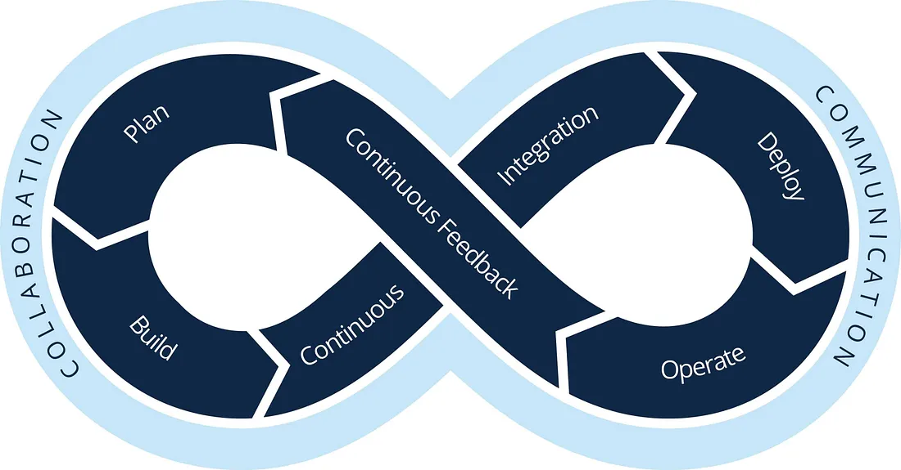

Hi, there. If you are reading this article, this means you are keen to get started with DevOps. Without wasting time, lets get into the specifics.

## What is DevOps?

DevOps, as a term, comes from the smashing together of ‘Development and Operations’ to create a more-or-less self-explanatory term. It is a strategy that bridges the gap between software development and IT operations.

## What is the role of a DevOps engineer?

The role of a DevOps engineer may vary from one organization to another, but generally, it is some combination of release engineering, infrastructure provisioning and management, system administration, infrastructure optimization and security.

## What are the tools used by DevOps engineers?

Regardless of the type of DevOps toolchain an organization uses, a DevOps process needs to use the right tools to address the key phases and requirements of the DevOps lifecycle:

- Planning : 
    - [Jira](https://www.atlassian.com/software/jira) (Popular),
    - [Redmine](https://www.redmine.org/),
    - [Trac](https://trac.edgewall.org/),
    - [Rally](https://www.broadcom.com/products/software/value-stream-management/rally), etc

- CI/CD : 
    - [Jenkins](https://www.jenkins.io/) (Popular),
    - [Github Actions](https://github.com/features/actions) (Popular)
    - [CircleCI](http://circleci.com/) (Popular),
    - [TeamCity](https://www.jetbrains.com/teamcity/),
    - [Azure DevOps](https://azure.microsoft.com/en-us/services/devops/), etc.

- Build Tools :
    - [Maven](https://maven.apache.org/) (Popular),
    - [Gradle](https://gradle.org/) (Popular),
    - [Ant](https://ant.apache.org/),
    - [GNU Make](https://www.gnu.org/software/make/) (Popular), etc.

- Containerization :
    - [Docker](https://www.docker.com/),
    - [Kubernetes](https://kubernetes.io/),
    - [Rancher](https://rancher.com/),
    - [OpenShift](https://www.openshift.com/),
    - [AKS](https://azure.microsoft.com/en-us/services/kubernetes-service/),
    - [EKS](https://aws.amazon.com/eks/),
    - [GKE](https://cloud.google.com/kubernetes-engine), etc.

- Configuration Management :
    - [Ansible](https://www.ansible.com/),
    - [Puppet](https://puppet.com/),
    - [Chef](https://www.chef.io/),
    - [SaltStack](https://saltstack.com/),
    - [Terraform](https://www.terraform.io/),
    - [CloudFormation](https://aws.amazon.com/cloudformation/),
    - [Azure Resource Manager](https://azure.microsoft.com/en-us/resources/templates/), etc.

- Source Code Management :
    - [Git](https://git-scm.com/),
    - [GitHub](https://github.com/),
    - [GitLab](https://about.gitlab.com/),
    - [BitBucket](https://bitbucket.org/),
    - [Azure DevOps](https://azure.microsoft.com/en-us/services/devops/),
    - [AWS CodeCommit](https://aws.amazon.com/codecommit/),
    - [Google Cloud Source Repositories](https://cloud.google.com/source-repositories), etc.

- Cloud :
    - [Azure](https://azure.microsoft.com/en-us/),
    - [AWS](https://aws.amazon.com/),
    - [GCP](https://cloud.google.com/),
    - [Digital Ocean](https://www.digitalocean.com/),

- Monitoring : 
    - [Prometheus](https://prometheus.io/) (Infrastructure), 
    - [Grafana Loki](https://grafana.com/oss/loki/) (Logs), 
    - [Splunk](https://www.splunk.com/), 
    - [ELK stack](https://www.elastic.co/elastic-stack), 
    - [Datadog](https://www.datadoghq.com/),
    - [NewRelic](https://newrelic.com/), etc.

- Communication :
    - [Slack](https://slack.com/),
    [Microsoft Teams](https://www.microsoft.com/en-us/microsoft-teams/group-chat-software),
    - [Zoom](https://zoom.us/),
    - [Google Meet](https://meet.google.com/), etc.

## What are the prerequisites for a DevOps engineer?

You must have got to know by now, the tools should you explore and this will give you a headstart.

Now, let’s have a look at some of the pre-requisites to be a good DevOps engineer:

- **Understanding Containers**: Containers virtualize the operating system and not the hardware so that the virtualized environments are lightweight and highly scalable. For more visit here.

- **Understanding DevOps tools and technologies**: It is important to understand the tools and technologies generally used in the industry to understand and formulate better strategies and work on efficient solutions.

- **Understanding Scripting languages**: It is a must to have good experience in common scripting languages like Bash, Batch and Python. Most of the DevOps tools require some level of scripting to automate things to the highest standard. For example, Ansible uses a YAML scripting language for automation, which is primarily based on Python.

- **Collaboration and Communication Skills**: A DevOps engineer is known to form the bridge between development teams and IT operations, making communication and collaboration skills the DevOps prerequisites. Communication skills help to avoid misinterpretations enabling a high-performance environment for teams to function.

- **Knowledge of Networking fundamentals**: Networking helps to integrate the edge services that are deployed on different containers or virtual machines. Networking also helps in troubleshooting various latency and performance issues.

- **Overall Computer Science Knowledge**: DevOps engineers are going to interact with software development teams, testing teams, and the IT operations team regularly. As such, a DevOps engineer must have at least the basic knowledge of almost all the concepts in computer science, including algorithms, networking, cloud, data science, etc.

- **Logical Attitude**: DevOps engineers will sometimes have to make spontaneous decisions for smooth functioning in the team. Since DevOps engineers are known to fill the gap between developers and IT operations, communication and collaboration become key. DevOps engineers thus have to carry a sound rationale and logical attitude throughout.

- **Passion**: A DevOps engineer is expected to be passionate about the work he is doing. Doing work with passion is the ultimate key to success in any career path. It is one of the crucial DevOps prerequisites that should never be overlooked.

## Conclusion

DevOps has taken center stage in the software development field, and it is evolving every day. This blog post is too small, and I can write about DevOps so much because there are so many innovations happening around this field. Companies are experimenting with various ways to accelerate their DevOps process so they can win over the competition.

So many developers, test engineers, and people from other industries want to learn DevOps because of the importance it has received over recent years. Well, DevOps is a great career; you have made a good choice of choosing it as your career path, and I hope that this article has the fundamentals you require to start your DevOps Journey.

Thanks for visiting and stay tuned for the next one. Until then, keep learning and stay secure!

